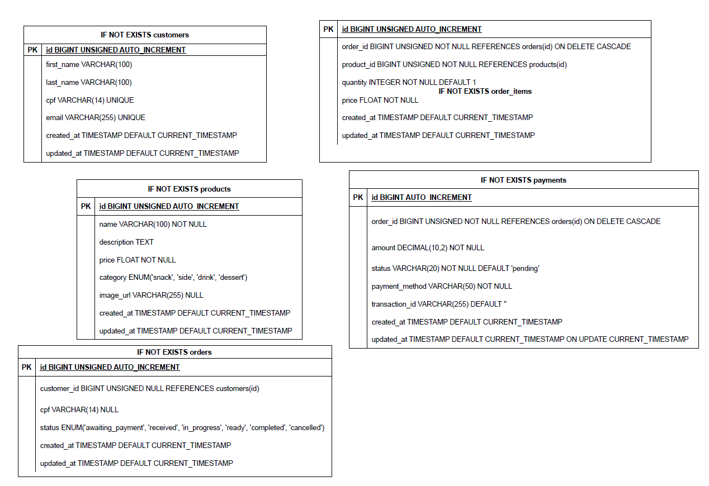

# Tech Challenge - Sistema de Autoatendimento para Lanchonete

Este projeto é parte do **Tech Challenge - Fase 03**, implementando um sistema completo de controle de pedidos para lanchonete com arquitetura Clean Code, Clean Architecture e infraestrutura Kubernetes.

## 📋 Índice

- [Visão Geral](#-visão-geral)
- [Banco de Dados](#-diagrama-de-entidade-relacionamento)
- [Instalação](#-instalação)

## 🎯 Visão Geral

Este repositório implementa a infraestrutura de banco de dados para o sistema de autoatendimento para lanchonetes seguindo os padrões **Clean Code** e **Clean Architecture**, com infraestrutura **Kubernetes** para alta disponibilidade e escalabilidade.


## 🏗️ Banco de dados

### Diagrama de Entidade Relacionamento



### Como a Aplicação se Comunica com o Banco?
1. **Pods da Aplicação** fazem conexões TCP na porta 3306
2. **AWS RDS MySQL 8.0** (`soatfastfood`) roteia para o **MySQL Pod**
3. **Configurações** injetadas via **ConfigMap** (host, porta, database) e **Secret** (senha)
4. **Dados persistidos** no **PVC** (10Gi) para sobreviver a restarts

## ⚙️ Configuração

### Pré-requisitos

- **Git** - Para clonar o repositório
- **Terraform**: ~> 1.13.2
- **AWS CLI**: Configurado com perfil `default` (execução local do terraform)
- **AWS Role**: Configurado com a role `soat-tech-challenge-fast-food-role` (execução via actions do terraform)
```json
{
    "Path": "/",
    "RoleName": "soat-tech-challenge-fast-food-role",
    "RoleId": "AROAUWX4ZSPFOKAB37J5H",
    "Arn": "arn:aws:iam::323726447562:role/soat-tech-challenge-fast-food-role",
    "CreateDate": "2025-10-07T00:25:19+00:00",
    "AssumeRolePolicyDocument": {
        "Version": "2012-10-17",
        "Statement": [
            {
                "Sid": "Administrator",
                "Effect": "Allow",
                "Principal": {
                    "AWS": "arn:aws:iam::323726447562:user/terraform"
                },
                "Action": "sts:AssumeRole"
            }
        ]
    },
    "Description": "",
    "MaxSessionDuration": 3600
}
```
- **Permissões AWS**: Adequadas para criar recursos

### Instalação

1. Clone o repositório:
```bash
git clone https://github.com/samuellalvs/soat_tech_challenge_fast_food_db_infra.git
cd soat_tech_challenge_fast_food_db_infra
```

## ⚙️ Pipeline de deploy do banco de dados via Github Actions
```bash
.github/workflows/pipeline.yml
```
